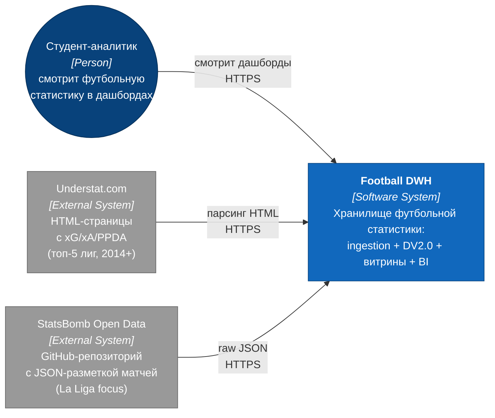

# C4: Context-уровень

Внешние границы Football DWH: один пользователь и два источника данных.
Внутреннее устройство — на уровне Containers (`02_c4_containers.md`).

## Описание

| Элемент | Тип | Роль |
|---|---|---|
| **Студент-аналитик** | Person | Открывает дашборды Superset, фильтрует по лиге/сезону |
| **Football DWH** | System | Целевая система — данные, расчёты, BI |
| **Understat** | External | Основной источник: xG, xA, PPDA, расширенная разметка матчей |
| **StatsBomb Open Data** | External | Дополнительный источник: исторические данные La Liga (Barcelona-фокус) |

Архитектура внутри `Football DWH` показана на следующей диаграмме —
[02_c4_containers.md](./02_c4_containers.md).
