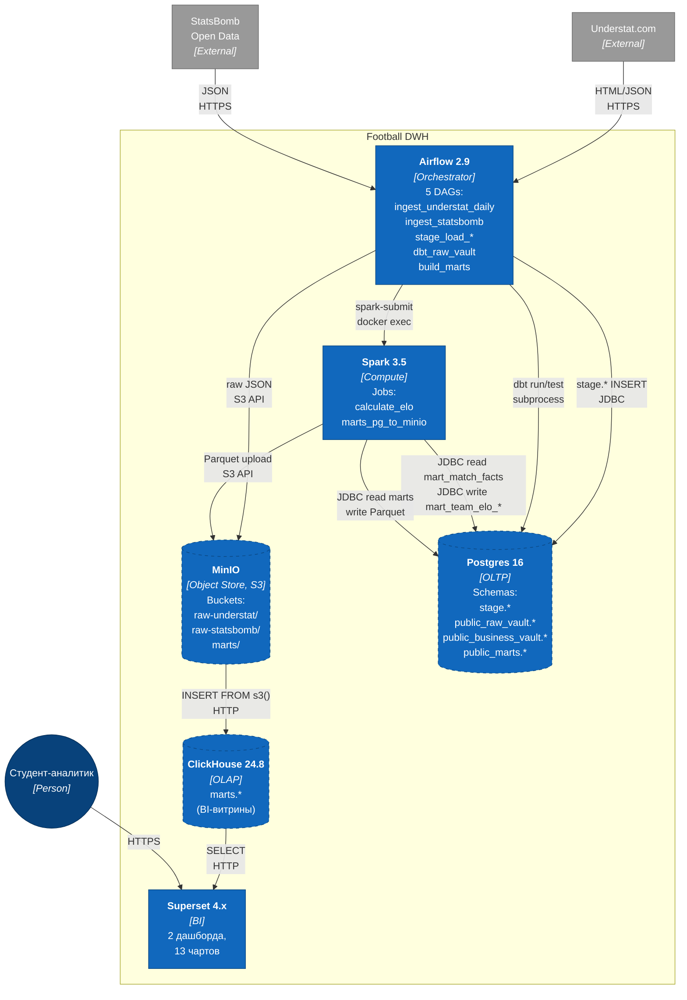

# C4: Containers-уровень

Внутреннее устройство Football DWH — 6 контейнеров и протоколы между ними.
Все контейнеры запускаются через `docker-compose` (см. `docker-compose.yml`).

## Контейнеры

| Контейнер | Технология | Роль |
|---|---|---|
| **Airflow** | Apache Airflow 2.9, Python 3.11 | Оркестрация всех DAG-ов; Datasets-цепочка для Understat |
| **MinIO** | MinIO (S3-совместимый) | Raw lake (партиции `dt=YYYY-MM-DD/source/endpoint/`) + хранилище Parquet-витрин |
| **Postgres** | PostgreSQL 16 | DV2.0 (raw_vault + business_vault) + промежуточные marts перед переливом в CH |
| **Spark** | Apache Spark 3.5 (master+1 worker) | Расчёт Elo (per-league ClubElo) + перелив `mart_*` в Parquet |
| **ClickHouse** | ClickHouse 24.8 | OLAP-слой для BI; финальное место витрин |
| **Superset** | Apache Superset 4.x | Дашборды и чарты поверх ClickHouse |

## Ключевые протоколы и интеграции

- **Airflow → Spark**: запуск через `docker exec spark-master spark-submit` (внутри `build_marts` DAG-а). Альтернатива через `SparkSubmitOperator` отвергнута — нужны JAR-зависимости через Maven, которые из РФ нестабильно отдаются.
- **PG → ClickHouse**: переливаем не напрямую (нет CH JDBC connector в Spark образе), а через Parquet в MinIO + `ClickHouse INSERT FROM s3()`. Дешевле и кэшируется.
- **Datasets** (Airflow 2.4+): `ingest_understat_daily → stage_load_understat → dbt_raw_vault` срабатывают по событиям, а не по cron.
