# DFD: Поток данных по слоям

Полный путь данных от источников до дашбордов. 8 шагов = 8 стрелок.
Каждый слой имеет одну ответственность; формат данных меняется на каждой границе.

```mermaid
flowchart LR
    classDef src fill:#999,stroke:#666,color:#fff
    classDef raw fill:#FFB020,stroke:#7A5300,color:#000
    classDef stage fill:#FFE4A0,stroke:#7A5300,color:#000
    classDef rv fill:#1168BD,stroke:#0B4884,color:#fff
    classDef bv fill:#0B5A9E,stroke:#062E50,color:#fff
    classDef mart fill:#1FA8C9,stroke:#0E6680,color:#fff
    classDef bi fill:#13B25C,stroke:#0A6E38,color:#fff

    understat[/"Understat<br/>HTML/"/]:::src
    statsbomb[/"StatsBomb<br/>JSON"/]:::src

    raw_minio[("MinIO<br/><b>raw-*</b><br/>partition by dt")]:::raw

    stage_pg[("Postgres<br/><b>stage.*</b><br/>jsonb-таблицы")]:::stage

    rv[("Postgres<br/><b>public_raw_vault.*</b><br/>5 hubs<br/>5 links<br/>6 satellites<br/>(datavault4dbt, MD5)")]:::rv

    bv[("Postgres<br/><b>public_business_vault.*</b><br/>2 PIT-таблицы<br/>2 Bridge-таблицы")]:::bv

    marts_pg[("Postgres<br/><b>public_marts.*</b><br/>6 dbt-витрин")]:::mart

    spark_elo["Spark<br/><b>calculate_elo</b><br/>JDBC read+write"]:::mart

    elo_marts[("Postgres<br/><b>mart_team_elo_*</b><br/>(пишет Spark)")]:::mart

    parquet[("MinIO<br/><b>marts/</b><br/>Parquet")]:::mart

    ch[("ClickHouse<br/><b>marts.*</b><br/>8 витрин")]:::mart

    superset["Superset<br/><b>2 дашборда<br/>13 чартов</b>"]:::bi

    understat -->|"1. ingest<br/>raw JSON<br/>daily/manual"| raw_minio
    statsbomb -->|"1. ingest<br/>raw JSON<br/>manual"| raw_minio
    raw_minio -->|"2. stage_load_*<br/>jsonb<br/>by Dataset"| stage_pg
    stage_pg -->|"3. dbt_raw_vault<br/>SQL hubs/links/sats<br/>by Dataset"| rv
    rv -->|"4. dbt build<br/>PIT/Bridge"| bv
    bv -->|"5. dbt build<br/>SQL marts"| marts_pg
    marts_pg -->|"6a. JDBC read mart_match_facts"| spark_elo
    spark_elo -->|"6b. JDBC write Elo"| elo_marts
    elo_marts -.->|"included in"| marts_pg
    marts_pg -->|"7a. Spark JDBC read<br/>+ write Parquet"| parquet
    parquet -->|"7b. mc cp"| parquet
    parquet -->|"7c. INSERT FROM s3()<br/>build_marts DAG"| ch
    ch -->|"8. SELECT (HTTP)"| superset
```

## Шаги конвейера

| # | Шаг | Источник | Приёмник | Кто запускает |
|---|---|---|---|---|
| 1 | Ingestion | Understat HTML / StatsBomb JSON | MinIO `raw-*` | DAG `ingest_understat_daily` (cron) / `ingest_statsbomb` (manual) |
| 2 | Stage load | MinIO `raw-*` | Postgres `stage.*` (jsonb) | DAG `stage_load_*` (Dataset) |
| 3 | Raw Vault | Postgres `stage.*` | Postgres `public_raw_vault.*` | DAG `dbt_raw_vault` (Dataset) |
| 4 | Business Vault | RV | Postgres `public_business_vault.*` | DAG `build_marts` (manual) |
| 5 | Marts (PG) | BV | Postgres `public_marts.*` | DAG `build_marts` (manual) |
| 6 | Spark Elo | `mart_match_facts` | `mart_team_elo_*` (PG) | `scripts/run_spark_elo.sh` (manual) |
| 7 | PG → CH | PG `public_marts.*` → MinIO Parquet → CH | ClickHouse `marts.*` | `scripts/run_spark_marts.sh` + `build_marts` |
| 8 | BI | ClickHouse `marts.*` | Superset чарты | по запросу пользователя |

## Datasets-цепочка (Этап 8)

Шаги 1-3 для Understat-pipeline автоматизированы через **Airflow Datasets**:
- `ingest_understat_daily` — `outlets=[ds_understat_raw]`
- `stage_load_understat` — `schedule=[ds_understat_raw], outlets=[ds_understat_stage]`
- `dbt_raw_vault` — `schedule=[ds_understat_stage], outlets=[ds_raw_vault]`

После одного `trigger ingest_understat_daily` остальные срабатывают автоматически по событиям.
StatsBomb-конвейер остался manual (one-off backfill).

Шаги 4-7 (`build_marts`) остались **manual** — Airflow-контейнер не имеет доступа к docker socket, поэтому `docker exec spark-master spark-submit` нельзя запустить из DAG-а.
