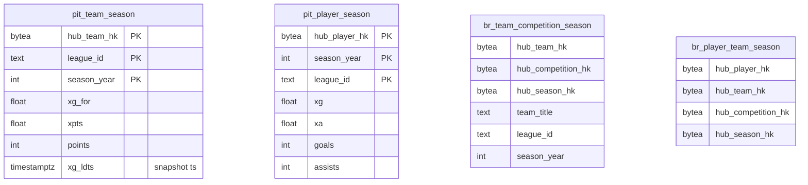

# ER: Data Vault 2.0 (Raw Vault + Business Vault)

Парадигма Data Vault 2.0 в Postgres-схемах `public_raw_vault.*` и
`public_business_vault.*`. Сборка через `datavault4dbt` (MD5-hashing).

## Raw Vault: Hubs / Links / Satellites

```mermaid
erDiagram
    hub_team {
        bytea hub_team_hk PK
        text team_bk
        timestamptz ldts
        text rsrc
    }
    hub_player {
        bytea hub_player_hk PK
        text player_bk
        timestamptz ldts
        text rsrc
    }
    hub_match {
        bytea hub_match_hk PK
        text match_bk
        timestamptz ldts
        text rsrc
    }
    hub_competition {
        bytea hub_competition_hk PK
        text competition_bk
        timestamptz ldts
        text rsrc
    }
    hub_season {
        bytea hub_season_hk PK
        text season_bk
        timestamptz ldts
        text rsrc
    }

    lnk_match_team {
        bytea lnk_match_team_hk PK
        bytea hub_match_hk FK
        bytea hub_team_hk FK
        text role "home/away"
    }
    lnk_player_team {
        bytea lnk_player_team_hk PK
        bytea hub_player_hk FK
        bytea hub_team_hk FK
        bytea hub_competition_hk FK
        bytea hub_season_hk FK
    }
    lnk_team_competition_season {
        bytea lnk_team_comp_season_hk PK
        bytea hub_team_hk FK
        bytea hub_competition_hk FK
        bytea hub_season_hk FK
    }
    lnk_match_competition_season {
        bytea lnk_hk PK
        bytea hub_match_hk FK
        bytea hub_competition_hk FK
        bytea hub_season_hk FK
    }
    lnk_match_same_as {
        bytea lnk_hk PK
        bytea hub_match_hk_a FK
        bytea hub_match_hk_b FK
    }

    sat_team_details {
        bytea hub_team_hk FK
        timestamptz ldts PK
        text team_title
        text team_short_name
    }
    sat_team_xg {
        bytea hub_team_hk FK
        timestamptz ldts PK
        float xg_for
        float xg_against
        float ppda
        float xpts
        int wins_draws_losses
    }
    sat_player_xg {
        bytea hub_player_hk FK
        timestamptz ldts PK
        float xg
        float xa
        int goals
        int assists
    }
    sat_match_score {
        bytea hub_match_hk FK
        timestamptz ldts PK
        int home_goals
        int away_goals
        text match_status
    }
    sat_match_score_understat {
        bytea hub_match_hk FK
        timestamptz ldts PK
        int home_goals
        int away_goals
    }
    sat_match_xg {
        bytea hub_match_hk FK
        timestamptz ldts PK
        float home_xg
        float away_xg
    }

    hub_team ||--o{ lnk_match_team : ""
    hub_match ||--o{ lnk_match_team : ""
    hub_player ||--o{ lnk_player_team : ""
    hub_team ||--o{ lnk_player_team : ""
    hub_competition ||--o{ lnk_player_team : ""
    hub_season ||--o{ lnk_player_team : ""
    hub_team ||--o{ lnk_team_competition_season : ""
    hub_competition ||--o{ lnk_team_competition_season : ""
    hub_season ||--o{ lnk_team_competition_season : ""
    hub_match ||--o{ lnk_match_competition_season : ""
    hub_competition ||--o{ lnk_match_competition_season : ""
    hub_season ||--o{ lnk_match_competition_season : ""
    hub_match ||--o{ lnk_match_same_as : ""

    hub_team ||--o{ sat_team_details : ""
    hub_team ||--o{ sat_team_xg : ""
    hub_player ||--o{ sat_player_xg : ""
    hub_match ||--o{ sat_match_score : ""
    hub_match ||--o{ sat_match_score_understat : ""
    hub_match ||--o{ sat_match_xg : ""
```

## Business Vault: PIT + Bridge

## Ключевые архитектурные решения

| Решение | Обоснование |
|---|---|
| **MD5 для hash-ключей** (не SHA-256) | Меньше места, для DV2.0 хватает; зафиксировано в `dbt_project.yml` — после Этапа 3 менять нельзя без перестройки RV |
| **`bytea` для ключей** | Нативный binary в Postgres, экономнее чем `text`-hex |
| **`hub_match.match_bk` префиксован: `'sb\|...'` или `'understat\|...'`** | Один хаб для двух источников; ключ восстанавливаемый, видно происхождение записи |
| **`lnk_match_same_as`** | Связь между SB- и Understat-версиями одного матча; нужна для будущей фьюжн-логики |
| **`lnk_player_team` через 4 хаба** (player+team+competition+season) | Игроки переходят между клубами в середине сезона — гранулярность по сезону снимает FK-конфликт |
| **2 sat для счёта** (`sat_match_score`, `sat_match_score_understat`) | StatsBomb и Understat имеют разные источники истины; держим оба, конфликт разрешается на BV |
| **PIT по `xg_ldts`** | Берём latest строку sat_team_xg по `ldts DESC` — Understat пересчитывает сезонные итоги, поэтому "снимок на конец сезона" = последняя версия |

## Зачем DV2.0 в курсовой

1. **Multi-source без боли**: Understat и StatsBomb пишутся в одни и те же hub-ключи через префикс BK. Не нужно "выбирать главный источник".
2. **Полный аудит**: каждое изменение пишется новой строкой satellite (с новым `ldts` и `hashdiff`), история не теряется.
3. **Идемпотентность ingestion**: re-run одного и того же дня не плодит дубли (hashdiff фильтрует).
4. **Расширяемость**: добавить третий источник = добавить новый stage-слой и связать через те же hub-ключи. RV/BV не меняются.
