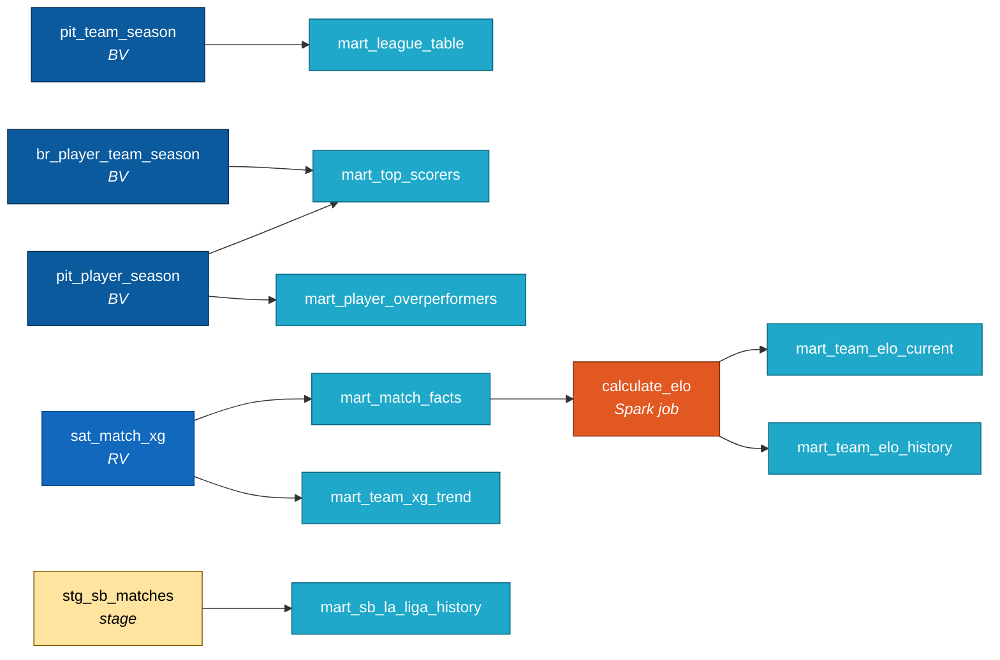

# ER: Marts + lineage

8 финальных витрин (6 dbt + 2 Spark Elo). Зеркальные таблицы в ClickHouse
(`marts.*`) используют те же имена. Lineage показывает источники в DV.

## Lineage: как mart_* собираются из DV

## Список витрин

| Витрина | Грейн | Источник | Зачем |
|---|---|---|---|
| `mart_league_table` | team × competition × season | `pit_team_season` | Турнирная таблица: pts/xpts/gf/ga/ppda/position |
| `mart_top_scorers` | player × team × season | `pit_player_season + br_player_team_season` | Бомбардиры: goals/xg/assists/minutes |
| `mart_match_facts` | match | `sat_match_xg` | Факты матчей: home/away xg, total_xg, goal_diff |
| `mart_player_overperformers` | player × season | `pit_player_season` | Top по `goals - xg` (over/under) |
| `mart_team_xg_trend` | team × season | `sat_match_xg` | Avg/std xG по матчам команды за сезон |
| `mart_sb_la_liga_history` | season | `stg_sb_matches` (SB) | История Barcelona в La Liga (Этап 8) |
| `mart_team_elo_current` | team × league | `mart_match_facts → Spark calculate_elo` | Текущий Elo + peak |
| `mart_team_elo_history` | team × match × league | `mart_match_facts → Spark` | Эволюция Elo по матчам, флаг top-3 в лиге |

## Зеркала в ClickHouse

Все 8 витрин дублируются в схеме `marts.*` ClickHouse через путь:
`Postgres → Spark JDBC.read → Parquet в MinIO → mc cp → CH INSERT FROM s3()`.

DDL ClickHouse-таблиц лежит в `stage/ddl/clickhouse_marts.sql`. Grain и колонки
совпадают с PG-версией (типы `Float64`/`UInt*`/`Date`).

## Покрытие дашбордов

- **Football DWH** (9 чартов): `mart_league_table`, `mart_top_scorers`, `mart_player_overperformers`, `mart_match_facts`, `mart_team_xg_trend`, `mart_team_elo_current`, `mart_team_elo_history`, `mart_sb_la_liga_history`
- **European Teams** (4 чарта): `mart_team_elo_current`, `mart_league_table`, `mart_top_scorers`, `mart_match_facts`
