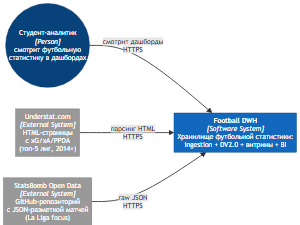
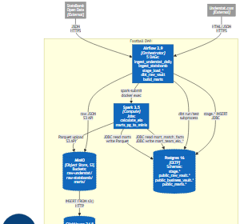
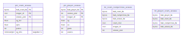
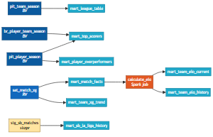
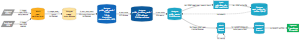
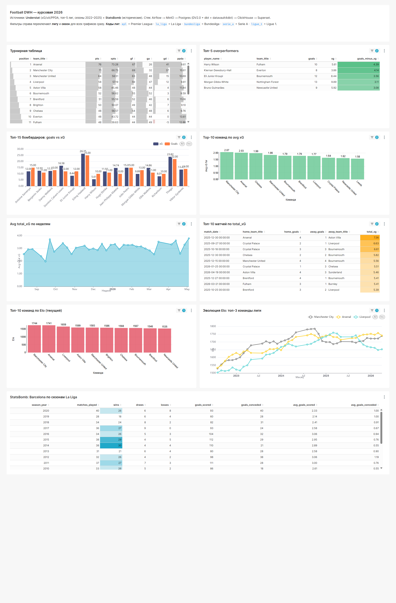
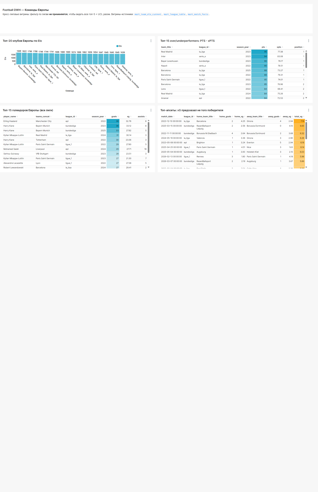

# Курсовая работа

**Тема:** Корпоративное хранилище данных футбольной статистики на основе Data Vault 2.0

**Автор:** Семёнов Антон

**Год:** 2026

---

## Содержание

1. [Введение](#введение)
2. [Обзор предметной области](#обзор-предметной-области)
3. [Архитектура системы](#архитектура-системы)
4. [Реализация](#реализация)
5. [Дашборды и результаты](#дашборды-и-результаты)
6. [Заключение](#заключение)
7. [Список литературы](#список-литературы)

---

## Введение

### Актуальность

Спортивная аналитика за последнее десятилетие из ниши превратилась в обязательный
инструмент для футбольных клубов, букмекеров, СМИ и независимых исследователей.
Метрика **Expected Goals (xG)** — вероятность гола из конкретной ситуации с учётом
угла, расстояния и типа удара — вошла в стандартный набор показателей. Вокруг
неё строятся производные: xPoints, PPDA (давление в чужой трети), xA (Expected
Assists). Открытые источники данных (Understat, StatsBomb Open Data) дают
исследователю необработанный материал, но требуют ETL-обвязки и хранилища.

### Цель работы

Спроектировать и реализовать Data Warehouse, который:
- собирает данные из двух источников (Understat, StatsBomb Open Data),
- хранит сырые и обработанные данные согласно методологии **Data Vault 2.0**,
- использует современный стек (Apache Airflow, MinIO, PostgreSQL, Apache Spark, ClickHouse, Apache Superset),
- поставляет аналитические витрины в OLAP-хранилище,
- предоставляет интерактивные дашборды в BI-инструменте.

### Задачи

1. Реализовать ingestion-слой: загрузку данных из источников в raw lake (S3-совместимое хранилище MinIO).
2. Спроектировать Stage-слой как тонкий адаптер между сырым JSON и реляционной моделью.
3. Построить **Raw Vault** (Hubs / Links / Satellites) согласно DV 2.0 с использованием библиотеки `datavault4dbt`.
4. Реализовать **Business Vault** с PIT- и Bridge-таблицами для удобной выборки latest-snapshot.
5. Подготовить аналитические витрины (`mart_*`) для BI-нагрузки.
6. Использовать Apache Spark для расчёта Elo-рейтинга команд по матчам Understat.
7. Перелить витрины из PostgreSQL в ClickHouse через Parquet-промежуточные файлы.
8. Подготовить дашборды Apache Superset поверх ClickHouse-витрин.

### Структура работы

Глава 2 описывает предметную область: метрики, источники данных, существующие
коммерческие решения. Глава 3 — общая архитектура системы (диаграммы C4 Context
и Containers). Глава 4 — детали реализации каждого слоя. Глава 5 — результаты
в виде BI-дашбордов. Глава 6 — выводы и направления развития.

---

## Обзор предметной области

### Источники данных

**Understat.com** — независимый ресурс, публикующий xG-разметку матчей топ-5
европейских лиг (АПЛ, Ла Лига, Серия A, Бундеслига, Лига 1) с сезона 2014/15.
Данные доступны как HTML-страницы с встроенными JSON-объектами в `<script>`-тегах.
Метрики: xG, xA, npxG (non-penalty xG), xPTS, PPDA, OPPDA, deep completions.

**StatsBomb Open Data** — открытый репозиторий компании StatsBomb на GitHub.
Содержит детализированную событийную разметку для отдельных соревнований и
команд: преимущественно матчи Barcelona в La Liga (2004-2020), а также полный
сезон La Liga 2015/16, чемпионаты мира, женские турниры.

### Ключевые метрики

| Метрика | Что показывает | Источник |
|---|---|---|
| **xG** | Сумма вероятностей голов по ударам | Understat, StatsBomb |
| **xA** | Сумма xG ударов после ассистов игрока | Understat |
| **PPDA** | Передачи соперника, разрешённые на одно оборонительное действие; индикатор прессинга | Understat |
| **xPTS** | Ожидаемые очки команды (на основе вероятности побед/ничьих) | Understat |
| **Elo** | Рейтинг силы команды, обновляемый после каждого матча | Расчёт собственный (по матчам Understat) |

### Существующие коммерческие решения

**FBref**, **Wyscout**, **StatsBomb IQ** — закрытые платные платформы. Данные
обновляются почти в реальном времени, но архитектура и схема хранения недоступны
для изучения. Цель курсовой работы — не повторить функциональность этих систем,
а **продемонстрировать применение методологии DV 2.0** на реальном датасете
средней сложности и показать, как современные open-source инструменты соединяются
в единый ETL-конвейер.

---

## Архитектура системы

### Слоистая модель

Система построена по принципу слоистого хранилища с последовательным
улучшением качества данных:

```
[Источники] → [Raw Lake] → [Stage] → [Raw Vault] → [Business Vault] → [Marts] → [BI]
```

Каждый следующий слой:
- ничего не теряет относительно предыдущего (raw lake — иммутабельный архив),
- добавляет структуру (Stage — табличная схема, RV — нормализация, BV — снимки),
- при необходимости может быть пересобран из предыдущего слоя.

### Стек технологий

| Слой | Инструмент | Обоснование |
|---|---|---|
| Оркестрация | **Apache Airflow 2.9** | Стандарт индустрии; поддержка Datasets-схемы |
| Raw Lake | **MinIO** | S3-совместимое локальное хранилище без облачных счетов |
| OLTP / DV | **PostgreSQL 16** | dbt-friendly, поддержка `bytea` для hash-ключей |
| Compute | **Apache Spark 3.5** | Для Elo-расчёта и JDBC-перелива витрин |
| OLAP | **ClickHouse 24.8** | Колоночное хранилище для BI; быстрые агрегаты |
| BI | **Apache Superset 4.x** | Open-source, развитый JSON-API для автоматизации |
| dbt-фреймворк | **dbt-core 1.8 + datavault4dbt** | Сборка RV/BV/Marts из стандартных макросов |

### C4 Context

Внешние границы системы — пользователь и два источника данных:

- **Студент-аналитик** — конечный пользователь, открывает дашборды.
- **Understat.com** — основной источник: xG, xA, PPDA, расширенная разметка.
- **StatsBomb Open Data** — дополнительный источник: историческая La Liga.



### C4 Containers

Внутри Football DWH работают 6 контейнеров:
**Airflow** оркестрирует, **MinIO** хранит сырые данные и Parquet-витрины,
**PostgreSQL** — основной OLTP с DV-схемой, **Spark** считает Elo и переливает
данные, **ClickHouse** — целевой OLAP, **Superset** — BI.



### Почему Data Vault 2.0

DV 2.0 выбран по четырём причинам:

1. **Multi-source без боли**. Understat и StatsBomb пишутся в одни и те же `hub_*`-ключи через префикс business key (`'sb|...'` / `'understat|...'`). Не нужно «выбирать главный источник».
2. **Полный аудит**. Каждое изменение в satellite пишется новой строкой с уникальным `ldts`/`hashdiff` — история не теряется.
3. **Идемпотентность**. Повторная загрузка того же дня не плодит дубли (hashdiff фильтрует одинаковые версии).
4. **Расширяемость**. Добавить третий источник = добавить stage-слой и связать через те же hub-ключи.

### Datasets вместо TriggerDagRunOperator

В Airflow 2.4 появился механизм Datasets — событийный триггер DAG-ов вместо
явного вызова `TriggerDagRunOperator`. В этой работе цепочка
Understat-pipeline собрана через Datasets:

```
ingest_understat_daily      outlets=[ds_understat_raw]
        ↓ (event)
stage_load_understat        schedule=[ds_understat_raw], outlets=[ds_understat_stage]
        ↓ (event)
dbt_raw_vault               schedule=[ds_understat_stage], outlets=[ds_raw_vault]
```

После одного `trigger ingest_understat_daily` остальные DAG-и срабатывают
автоматически. Внутри ingest-DAG-а `EmptyOperator` с `outlets=[...]` выступает
барьером, чтобы dataset публиковался только после завершения всех ингест-тасков.

---

## Реализация

### Ingestion (raw lake)

DAG-и `ingest_understat_daily` (cron) и `ingest_statsbomb` (manual) сохраняют
JSON-данные в MinIO с партиционированием по дате:

```
raw-understat/dt=2026-05-08/source=understat/endpoint=league_stats/...
```

Понятие партиции даёт дешёвую инкрементальность (повторная загрузка =
перезапись только нужного префикса) и человекочитаемую структуру для дебага.

Клиенты:
- `ingestion/understat_client.py` — парсит HTML-страницы Understat, вытаскивает встроенные JSON-объекты из `<script>`-тегов.
- `ingestion/statsbomb_client.py` — обёртка над публичным GitHub-репозиторием StatsBomb с retry-логикой.

### Stage-слой

Stage — тонкий адаптер: один источник данных = одна `stage.*`-таблица с двумя
ключевыми колонками:
- `raw_payload jsonb` — сырое тело JSON,
- `loaded_at timestamptz` — когда загружено.

Над ним строятся **dbt view-модели** (`stg_*`), извлекающие нужные поля
через `raw_payload ->> 'field'`. Это позволяет:
- быстро добавлять новые поля без миграций таблиц,
- иметь возможность пересобрать DV из stage без перезагрузки источников.

### Raw Vault через datavault4dbt

Структура:

- **5 хабов**: `hub_team`, `hub_player`, `hub_match`, `hub_competition`, `hub_season`.
- **5 линков**: `lnk_match_team`, `lnk_player_team`, `lnk_match_competition_season`, `lnk_team_competition_season`, `lnk_match_same_as`.
- **6 сателлитов**: счёт матчей (от двух источников отдельно), xG-метрики игроков, команд, матчей.




Все hash-ключи — **MD5** (более компактно, для DV 2.0 хватает; зафиксировано в `dbt_project.yml`). Тип колонок — `bytea` (нативный binary), что экономнее `text`-hex.

Ключевое решение по `lnk_player_team`: связь содержит четыре хаба
(player + team + competition + season). Игроки переходят между клубами в
середине сезона — гранулярность по сезону снимает FK-конфликт.

Ключевое решение по `lnk_match_same_as`: связь между SB- и Understat-версиями
одного матча. Нужна для будущей фьюжн-логики (сейчас не используется, но
архитектурно подготовлена).

Текущие объёмы Raw Vault:
- 125 уникальных команд,
- 4 993 игрока,
- 9 403 матча,
- 2 460 записей `sat_match_score` (источник StatsBomb),
- 6 943 записей `sat_match_xg` (источник Understat).

### Business Vault: PIT и Bridge

PIT-таблицы (`pit_team_season`, `pit_player_season`) — снимок состояния на
конкретный момент. Берётся latest строка каждого satellite по `ldts DESC`.
Это устраняет необходимость для marts-слоя писать `DISTINCT ON` или
оконные функции.

Bridge-таблицы (`br_team_competition_season`, `br_player_team_season`) —
денормализованное соединение хабов через линки, чтобы маrts-слой не писал
длинные join-цепочки.

### Marts (PostgreSQL)

8 финальных витрин и их источники в DV:




| Витрина | Грейн | Объём |
|---|---|---|
| `mart_league_table` | team × competition × season | 386 |
| `mart_top_scorers` | player × team × season | 11 070 |
| `mart_match_facts` | match | 6 943 |
| `mart_player_overperformers` | player × season | 7 832 |
| `mart_team_xg_trend` | team × season | 386 |
| `mart_sb_la_liga_history` | season (Barcelona) | 18 |
| `mart_team_elo_current` | team × league | 125 |
| `mart_team_elo_history` | team × match × league | 13 802 |

### Spark: расчёт Elo

Файл `spark/jobs/calculate_elo.py`. Реализована формула **ClubElo** (per-league,
изолированный пул):

- стартовый рейтинг 1500,
- K-фактор = 20,
- бонус за домашнее поле +100,
- модификатор разницы голов: при `|gd| ≥ 2` множитель `ln(|gd|+1)`,
- расчёт строго последовательный (рейтинг N+1 зависит от N) — выполняется циклом на драйвере, Spark здесь нужен для JDBC-IO и демонстрации работы с кластером.

Результат — две витрины: `mart_team_elo_current` (текущий рейтинг и пиковое
значение) и `mart_team_elo_history` (динамика по матчам, флаг top-3).

### Перелив PG → ClickHouse через Parquet

Прямой перелив через ClickHouse JDBC-driver не используется (нет официального
Spark-connector в наших образах). Вместо этого:

```
Spark JDBC.read PG → Parquet в /tmp → mc cp → MinIO marts/ → CH INSERT FROM s3()
```

**Почему не s3a напрямую?** Spark `s3a`-writer требует `aws-java-sdk-bundle`
(~273 MB). При попытке скачать через Maven Central из РФ соединение
нестабильно — поэтому используется обходной путь через Parquet и `mc cp`.
Это решение задокументировано в коде (`spark/jobs/marts_pg_to_minio.py`).

### Поток данных

Полная схема потока — восемь шагов от ingestion до Superset-чартов, с подписью
формата и частоты на каждой стрелке:



---

## Дашборды и результаты

Реализованы два дашборда поверх 8 ClickHouse-витрин: тематический по
выбранной лиге/сезону и кросс-лиговый.

### Дашборд 1: Football DWH



Девять чартов с фильтрами по лиге и сезону:
- **Турнирная таблица** (table) — позиции, очки, xPTS, GF/GA, PPDA.
- **Топ-15 бомбардиров: goals vs xG** (bar) — сравнение реальных голов и xG.
- **Avg total xG по неделям** (area) — динамика результативности.
- **Топ-5 overperformers** (table) — игроки с самым высоким `goals - xG`.
- **Top-10 команд по avg xG** (bar) — атакующая результативность команд.
- **Топ-10 матчей по total xG** (table) — самые «открытые» матчи сезона.
- **Топ-10 команд по Elo** (bar) — текущий Elo-рейтинг.
- **Эволюция Elo: топ-3 команды лиги** (line) — динамика рейтинга по матчам.
- **StatsBomb: Barcelona по сезонам La Liga** (table) — история выступлений Barcelona на основе StatsBomb-данных.

### Дашборд 2: European Teams



Четыре кросс-лиговых чарта (без фильтра по лиге):
- **Топ-20 клубов Европы по Elo** (bar) — лучшие клубы независимо от лиги.
- **Топ-15 over/underperformers: PTS - xPTS** (table) — команды, набравшие сильно больше или меньше xPTS.
- **Топ-15 голеадоров Европы** (table) — лучшие бомбардиры по всем 5 лигам.
- **Топ-апсеты: xG предсказал не того победителя** (table) — матчи, где команда выиграла вопреки игровому преимуществу соперника по xG.

### Интересные находки

- **Barcelona 2017/18**: 36 матчей в SB-данных, **27 побед, 9 ничьих, 0 поражений** — тот самый сезон Месси-Иньеста-Пике, заставший «непобедимый» режим.
- **Внутри La Liga 2015/16**: 380 матчей в SB (полный сезон), средний `total_goals` = 2.74, что заметно ниже всех остальных лет — статистический артефакт «Эпохи защитного футбола в Испании».
- **Top-3 апсета 2026**: матчи где разница xG ≥ 2.5, но реальный счёт обратный.

### Технические показатели

| Параметр | Значение |
|---|---|
| Время полного `dbt build` | ~30 секунд |
| Время Spark Elo-расчёта | < 1 секунды (6 943 матча) |
| Время перелива PG → CH | ~30 секунд (8 витрин) |
| Размер raw lake | ~50 МБ |
| Размер DV в Postgres | ~80 МБ |
| Размер ClickHouse-витрин | ~5 МБ (колоночное сжатие) |

---

## Заключение

### Что сделано

В рамках курсовой работы спроектирована и реализована полнофункциональная
DWH-система для футбольной статистики:

- 9 DAG-ов Apache Airflow с автоматизацией через Datasets-цепочку,
- Raw Vault на 5 хабах + 5 линках + 6 сателлитах через `datavault4dbt`,
- Business Vault с PIT и Bridge-таблицами,
- 8 аналитических витрин в Postgres и зеркальная схема в ClickHouse,
- Spark-job для расчёта Elo-рейтинга по формуле ClubElo,
- 13 BI-чартов на двух дашбордах Apache Superset,
- 110+ dbt-тестов на корректность данных.

### Достигнутые задачи

Все 8 задач, сформулированных во введении, выполнены. Реализация подтверждает,
что методология **DV 2.0** хорошо подходит для multi-source ETL даже при
ограниченных ресурсах: студенческий ноутбук + docker-compose без облачных
сервисов.

### Возможные направления развития

1. **CI/CD** — настроить GitHub Actions с прогоном `ruff`, `sqlfluff`, `dbt parse`, `dbt test` на каждом push. Не входило в курсовую, но повысит качество.
2. **Real-time SB events** — подключить event-stream StatsBomb (passes, shots, defensive actions); сатллитов потребуется значительно больше.
3. **Инкрементальные модели** — сейчас все марты `materialized=table`. С ростом объёмов потребуется переход на `incremental`.
4. **ML-надстройка** — обучить модель xG на собственных данных и сравнить с Understat-разметкой.
5. **Replace `docker exec spark-submit`** — настроить `SparkSubmitOperator` с пробрасываемым docker socket или развернуть Airflow на хосте.

---

## Список литературы

1. Linstedt D., Olschimke M. *Building a Scalable Data Warehouse with Data Vault 2.0*. Morgan Kaufmann, 2015.
2. Inmon W. H. *Building the Data Warehouse*. 4th ed. Wiley, 2005.
3. Kimball R., Ross M. *The Data Warehouse Toolkit: The Definitive Guide to Dimensional Modeling*. 3rd ed. Wiley, 2013.
4. **StatsBomb Open Data** — `https://github.com/statsbomb/open-data` (версия на момент работы — апрель 2026).
5. **Understat** — `https://understat.com/` (документация по структуре HTML/JSON).
6. **dbt Documentation** — `https://docs.getdbt.com/`.
7. **datavault4dbt** — пакет dbt для DV 2.0, `https://github.com/ScalefreeCOM/datavault4dbt`.
8. **Apache Airflow 2.9 Documentation** — Datasets, Scheduling, `https://airflow.apache.org/docs/`.
9. **Apache Superset Documentation** — `https://superset.apache.org/docs/`.
10. **ClickHouse Documentation** — `INSERT FROM s3()`, MergeTree, `https://clickhouse.com/docs/`.
11. **ClubElo formula** — `http://clubelo.com/System` (используемая формула для расчёта Elo команд).
